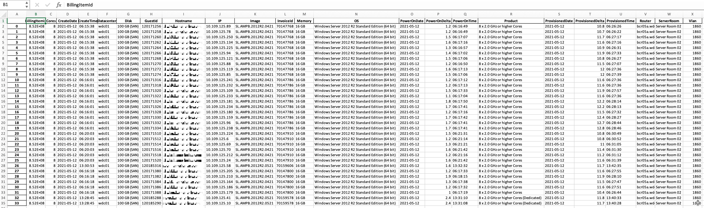

# **VSI STATS**

These scripts periodically capture VSI data during provisioning, and use it to create a daily report on provisioning
for IBM Cloud Classic Virtual Servers (VSIs).


**Prereq**
* IBM Cloud Classic Infrastructure (Aka Softlayer) apiKey and username.  
* IBM Cloudant Multi-tenant Lite tier instance (https://cloud.ibm.com/catalog/services/cloudant)
* Email Delivery, Powered by Sendgrid (https://cloud.ibm.com/catalog/infrastructure/email-delivery).
* A compute node (CentOS or Ubuntu recommended) with Python 3.8+ to run daily reports, and collect periodic provisioning data.  Compute Instance does not need to be in same account or even in the IBM Cloud, just needs to have access to the public SoftLayer API endpoint to collect data.

_Cloudant Database and periodic data collection process is only requried if expanded Datacenter and Image statistics are required._

### Configuration (config.ini)
* **[api]** section must include a valid IBM Cloud Classic Infrastructure credentials (aka SoftLayer)
  * The **userid** and **apikey** must have at least the following Classic Infrastructure permissions.
    * View Audit Log 
    * View Virtual Host Details
    * View Virtual Dedicated Host Details
    * Manage Public Images
  * **Userid** needs to also have the ability to view all existing and future virtual devices.
    * "Auto virtual server access" must be checked on permissions to allow script to read future provsioned VSI data.
* **[sendGrid]** section should contain your IBM Email Delivery powered by SendGrid credentials.
  * The **apiKey** should contain a valid sendGrid apiKey.
  * The **from** field must contain one valid email address.
  * The **to** field must contain at least one valid email address.  Multiple email addresses can be separated by a comma.
  * The **Subject** should specify the desired subject line of the nightly report emails.
* **[cloudant]** section should include your IBM Cloud for Databases Cloudant credentials.  If this section is left blank, the daily report will exclude provisioning statistics based on image or vlan data.
  * **username**  The username is the Cloudant instance name. 
  * **password**  The password is the ApiKey.  
```bazaar
[api]
username=<USERNAME>
apikey=<SOFTLAYER APIKEY>

[sendGrid]
apiKey = <sendgrid API>
from=email@ibm.com
to=email1@ibm.com, email2@ibm.com
subject = 'Daily Provisioning Report'

[cloudant]
username = <cloudant user>
password = <cloudant apikey>

```
### Scheduling Scripts to run.
* If you wish to collect statistics on images and vlan information the script must be run periodically (every 15 minutes recommended).  This data is only available while the instance is active.   The script stores the data in the Cloudant database for access when the daily report is run.
* The daily report should be run nightly, after 3am eastern time to ensure that it captures all the previous days provisioning events.  If the [Cloudant] section is left blank or
the trackProvisioningEvents script isn't run regularly the Datacenter and Image Statistics will be blank.
* The daily report can be run adhoc by running directly.   ````python generateDailyReport.py --date YYYY/MM/DD````
* If no date is specified it will default to running the report using the previous day.

### Suggested CRONTAB settings
````bazaar
#!/usr/bin/env bash
*/15 * * * * /directory/trackProvisioningReport.sh >> /var/log/events.log 2>&1
30 03 * * * /directory/generateDailyReport.sh  >> /var/log/daily.log 2>&1
````

### Python Requirements
* Python 3.8 or newer must be installed on the server first which will run the scripts.
* It is recommended that _virtualenv_ be used. (https://virtualenv.pypa.io/en/latest/)
  * to create a virtual environment in directory where scripts is installed type ````virtualenv venv````
  * to activate virtual environment ````source venv/bin/activate````.  Note the shell scripts will activate the environment before execution.
* [requirements.txt](requirements.txt) contain all the Python package requirements.  To install packages ````pip install -r requirements.txt````
* Adjust directories in the shell scripts to reflect the locations of the scripts and virtualenv.

### Daily Report Email output sent via IBM Cloud Email Delivery (aka Sendgrid)
* A daily email will be sent by [generateDailyReport.py](generateDailyReport.py) if sendgrid credentials are included in config.ini.
* In addition to the statisticssummary, an excel workbook with the detailed VSI data will be included.
* Detailed data such as Image, VLAN, and Datacenter are only available if running [trackProvisioningEvents.py](trackProvisioningEvents.py) periodically to
  collect and store data in the _Cloudant_ database.  This is because this data is only available while the VSI is running
  and is not stored in the invoice data. Therefore [trackProvisioningEvents.py](trackProvisioningEvents.py) captures this data and stored in Cloudant for use
  when creating the daily report.

````
Provisionings Statistics for 05/12/2021

Provisioning Statistics
	ProvisionedDelta
count 	34.000000
mean 	11.570588
std 	0.564897
min 	10.400000
25% 	11.250000
50% 	11.600000
75% 	11.900000
max 	12.800000

SLA Report
NotAllocatedIn30
0

Provisioning Time Distribution Report
Total	0to30	31-60	61-90	91-120	121-360	gt360
34	34	0	0	0	0	0

Datacenter & Image Statistics
		len 	amin 	average 	std 	amax
		ProvisionedDelta 	ProvisionedDelta 	ProvisionedDelta 	ProvisionedDelta 	ProvisionedDelta
Datacenter 	Image 					
wdc01 	SL.AMPB.2012R2.0421 	31.0 	10.4 	11.554839 	0.589824 	12.8
SL.AMPB.2012R2.0521 	3.0 	11.7 	11.733333 	0.057735 	11.8
All 		34.0 	10.4 	11.570588 	0.556528 	12.8


````
### Excel Daily Output Example



**Links**
SoftLayer Python SDK documentation
* https://softlayer-api-python-client.readthedocs.io/en/latest/

IBM Classic API's used
* https://sldn.softlayer.com/reference/services/SoftLayer_Account/getInvoices/
* https://sldn.softlayer.com/reference/services/SoftLayer_Account/getHourlyVirtualGuests/
* https://sldn.softlayer.com/reference/services/SoftLayer_Event_Log/

